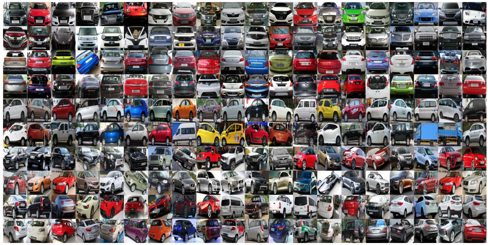
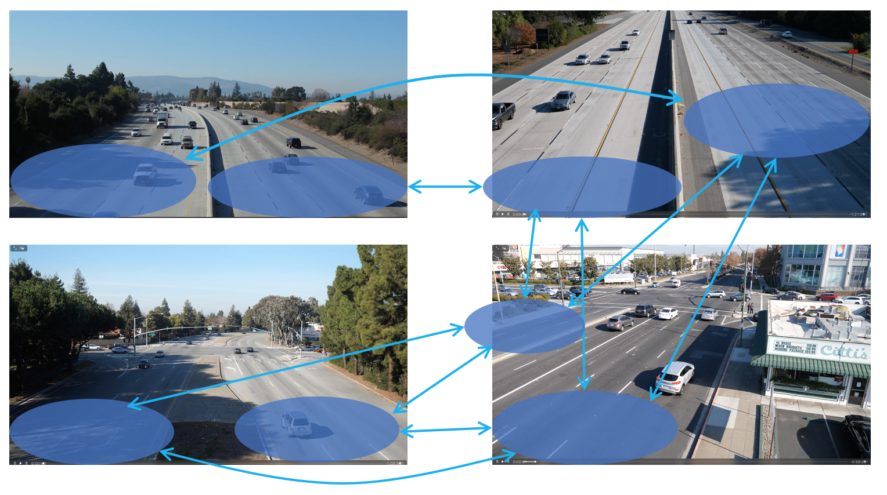

# Multi-Camera Vehicle Tracking and Re-identification

This is an implementation of vehicle re-identification for Task 3 in NVIDIA AI City Challenge. Please find the full source code [here](https://github.com/NVIDIAAICITYCHALLENGE/2018AICity_TeamUW).

## How It Works
It is based on a fusion of histogram-based adaptive appearance models, DCNN features, detected license plates, detected car types and traveling time information.

## Getting Started
### Prerequisites
* Linux
* [Caffe](http://caffe.berkeleyvision.org/)
* cv2

### Dataset
The following two datasets can be used to train a fine-grained classification model for different car models. You can find a pre-trained version [here](https://github.com/BVLC/caffe/wiki/Model-Zoo#googlenet_cars-on-car-model-classification).

#### CompCars dataset

The [Comprehensive Cars (CompCars) dataset](http://mmlab.ie.cuhk.edu.hk/datasets/comp_cars/index.html) contains data from two scenarios, including images from web-nature and surveillance-nature. The web-nature data contains 163 car makes with 1,716 car models. The dataset is well prepared for the following computer vision tasks:

* Fine-grained classification
* Attribute prediction
* Car model verification

Please refer the dataset website and follow the author's instruction to download the dataset.

#### BoxCars dataset
The [BoxCars dataset](https://medusa.fit.vutbr.cz/traffic/research-topics/fine-grained-vehicle-recognition/boxcars-improving-vehicle-fine-grained-recognition-using-3d-bounding-boxes-in-traffic-surveillance/) contains 116k of images of vehicles with fine-grained labels taken from surveillance cameras under various viewpoints.

### Camera View and Linked Area

### Instruction
Simply run ``bash run_all.sh`` and it will generate all possible candidate for further re-identification by [license plate comparison](https://github.com/NVIDIAAICITYCHALLENGE/2018AICity_TeamUW/tree/master/Track3/LP_COMP_IPL).

### Demo

The demo videos can be viewed [here](http://allison.ee.washington.edu/thomas/aicity18/).

## Reference

Z. Tang, G. Wang, H. Xiao, A. Zheng and J.-N. Hwang, "Single-camera and inter-camera vehicle tracking and 3D speed estimation based on fusion of visual and semantic features," in Proc. IEEE/CVF Conf. Comput. Vis. Pattern Recogn. Workshops (CVPRW), Jun. 2018. (to appear)

