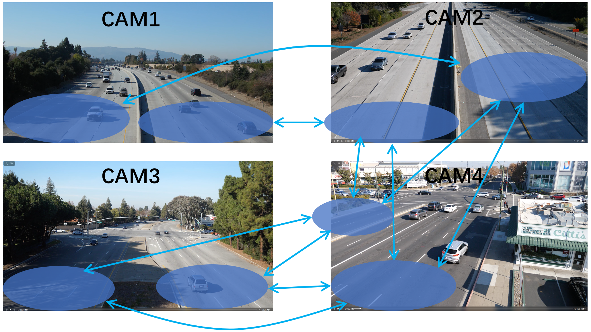

# Multi-Camera Vehicle Tracking and Re-identification

This repository contains our source code of Track 3 in the [NVIDIA AI City Challenge](https://www.aicitychallenge.org) Workshop at [CVPR 2018](http://cvpr2018.thecvf.com/program/workshops). 

[[Full source code]](https://github.com/AlexXiao95/2018AICity_TeamUW), 
[[Slides]](https://alexxiao95.github.io/publications/cvprw/cvpr_slides.pdf),
[[Paper]](http://openaccess.thecvf.com/content_cvpr_2018_workshops/papers/w3/Tang_Single-Camera_and_Inter-Camera_CVPR_2018_paper.pdf), 
[[Poster]](https://alexxiao95.github.io/publications/cvprw/cvpr_poster.pdf), 
[[Project Page]](https://alexxiao95.github.io/publications/cvpr2018), 
[[2018 NVIDIA AI City Challenge]](http://openaccess.thecvf.com/content_cvpr_2018_workshops/papers/w3/Naphade_The_2018_NVIDIA_CVPR_2018_paper.pdf)

## How It Works
We achieved Multi-Camera Vehicle Tracking and Re-identification based on a fusion of histogram-based adaptive appearance models, DCNN features, detected license plates, detected car types and traveling time information.

## Getting Started
### Prerequisites
* [darknet](https://pjreddie.com/darknet/)
* [Caffe](http://caffe.berkeleyvision.org/)
* pandas
* multiprocessing
* skimage
* cv2

The code has been tested on Ubuntu 16.04.

### Dataset

#### [Track 3 dataset](https://www.aicitychallenge.org/?page_id=9)
The track 3 dataset contains 15 videos from 4 different locations, each around 0.5-1.5 hours long, recorded at 30 fps and 1080p resolution (1920×1080). The task is to identify all vehicles that pass through each recorded location at least once in the given set of videos. The camera locations and linked areas are shown below:

 

#### [UA-DETRAC dataset](https://detrac-db.rit.albany.edu/Detection)

 

The UA-DETRAC dataset includes 10 hours of videos captured with a Canon EOS 550D camera at 24 different locations at Beijing and Tianjin in China. The videos are recorded at 25 frames per seconds (fps), with resolution of 960×540 pixels. There are more than 140 thousand frames in the UA-DETRAC dataset and 8250 vehicles that are manually annotated, leading to a total of 1.21 million labeled bounding boxes of objects. The primary aim of this dataset is to train vehicle detection algorithms.

#### [CompCars dataset](http://mmlab.ie.cuhk.edu.hk/datasets/comp_cars/index.html)

 

The Comprehensive Cars (CompCars) dataset contains data from two scenarios, including images from web-nature and surveillance-nature. The web-nature data contains 163 car makes with 1,716 car models. The dataset is well prepared for the following computer vision tasks:

* Fine-grained classification
* Attribute prediction
* Car model verification

You can find a pre-trained model [here](https://github.com/BVLC/caffe/wiki/Model-Zoo#googlenet_cars-on-car-model-classification). Please refer the dataset website and follow the author's instruction to download the dataset.

#### [BoxCars dataset](https://medusa.fit.vutbr.cz/traffic/research-topics/fine-grained-vehicle-recognition/boxcars-improving-vehicle-fine-grained-recognition-using-3d-bounding-boxes-in-traffic-surveillance/)

 

The BoxCars dataset contains 116k of images of vehicles with fine-grained labels taken from surveillance cameras under various viewpoints.

### Input/Output Format
Simply run ``bash src/run_all.sh`` in the command line. The input is single camera tracking results for all 15 videos by using our method in Track 1. The format of each line is as follows:

\<video_id\> \<frame_id\> \<obj_id\> \<xmin\> \<ymin\> \<xmax\> \<ymax\> \<speed\> \<confidence\>
  
* \<video_id\> is the video numeric identifier, starting with 1. It represents the position of the video in the list of all track videos, sorted in alphanumeric order.
* \<frame_id\> represents the frame count for the current frame in the current video, starting with 1.
* \<obj_id\> is a numeric identifier. It is integer. It can be ignored for Track 1 (set to -1).
* The axis-aligned rectangular bounding box of the detected video will be denoted by its pixel-valued coordinates within the image canvas, \<xmin\> \<ymin\> \<xmax\> \<ymax\>, computed from the top-left corner of the image (similar to the VOC2012 challenge format). All coordinates are integers.
* \<speed\> denotes the instantaneous speed of the vehicle in the given frame, measured in miles per hour (mi/h), which is a non-negative real value.
* \<confidence\> denotes the confidence of the prediction. Should be between 0 and 1.

The output is all possible candidates which will be used for [license plate comparison](https://github.com/AlexXiao95/2018AICity_TeamUW/tree/master/Track3/LP_COMP_IPL). The format of each line is as follows:

\<img_path\> \<similarity\>

* \<img_path\> is the path of probe vehicle and gallery vehicle. The first line is the probe image and the follwing is gallery images which are in a descending order in terms of similarity.
* \<similarity\> is the similarity between probe vehicle and gallery vehicle based on a fusion of histogram-based adaptive appearance models, DCNN features, detected car types and traveling time information. 

### Demo [[video]](https://alexxiao95.github.io/publications/cvpr2018)
 
 
 
 
 
 

## Reference

Please cite these papers in your publications if it helps your research:

    @inproceedings{tang2018vehicle,
      author = {Zheng Tang and Gaoang Wang and Hao Xiao and Aotian Zheng and Jenq-Neng Hwang},
      booktitle = {CVPR Workshop (CVPRW) on the AI City Challenge},
      title = {Single-camera and Inter-camera Vehicle Tracking and 3D Speed Estimation Based on Fusion of Visual and Semantic Features},
      year = {2018},
      pages = {108--115}
    }

